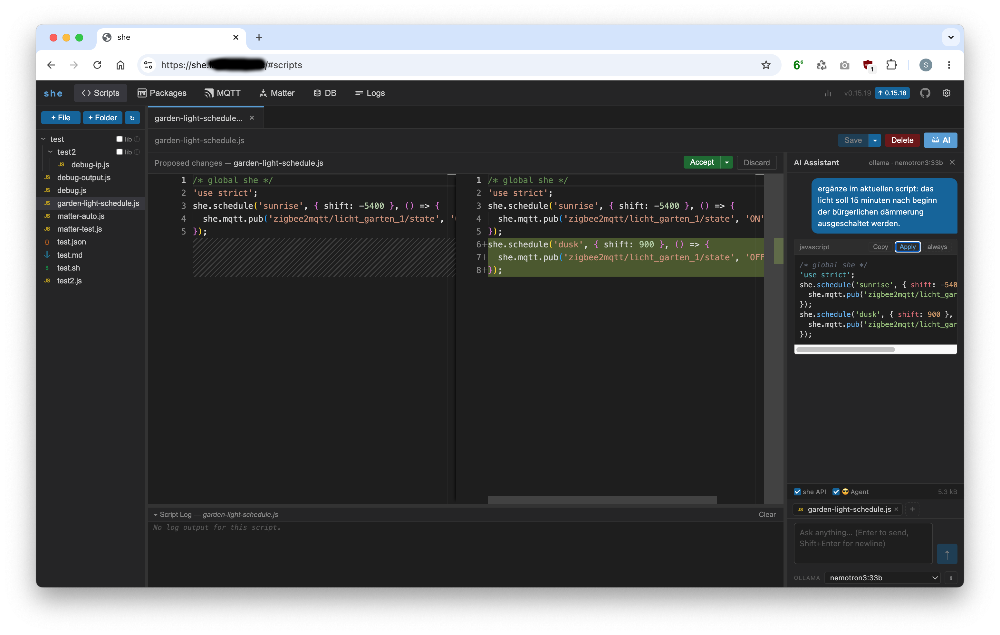

# she - smart home engine

Your home, your rules - written in plain JavaScript.

**she** is a Node.js daemon that loads your `.js` scripts into a sandboxed VM and wires them up to MQTT, Matter, and everything else your smart home throws at them. No cloud, no lock-in, no YAML sprawl, no opinionated bloated schemata. Just scripts that do exactly what you (if you want: with the help of the integrated AI assisstant) tell them.

- **Scripts** — Monaco-based Script IDE, AI assistant, git integration, autocompletion, hot-reload without process restart
- **MQTT** — subscribe, publish, react to state changes with wildcards, conditions, and delays
- **Matter** — control Matter devices directly from your scripts
- **sheDB** — lightweight document store with map/reduce views, right in the daemon
- **Scheduler** — cron expressions and solar events (`sunrise`, `sunset`, …) in one call
- **Script HTTP routes** — scripts can register their own REST endpoints under `/api/<scriptName>/`
- **`require()`** — load npm packages from `~/.she/node_modules/` or relative files inside scripts
- Supports **InfluxDB**, **Elasticsearch** and **Redis** — convenience methods for time series, full text indexing, shared states across multiple she instances
- **Broker management** — optional Mosquitto management: dynamic user/ACL management via the dynsec plugin (`she.broker.*` script API), listener and TLS configuration, TLS certificate management (server cert self-signed / CSR / import, trusted CA store), SSH-based remote file deployment
- **Web UI** — script editor, package manager, MQTT browser, Matter device manager, sheDB frontend, log viewer, broker manager

## Docs

| | |
|---|---|
| [Getting started](doc/getting-started.md) | Install, write your first script, configure |
| [Concepts](doc/concept.md) | Core ideas: zero-boilerplate scripting, MQTT vs. sheDB, git integration |
| [Script Engine](doc/script-engine.md) | How Scripts get executed, error handling, limitations |
| [Sandbox API](doc/sandbox-api.md) | Everything available inside a script |
| [sheDB](doc/db/README.md) | Embedded document store — script API, views, examples |
| [Broker management](doc/broker-management.md) | Mosquitto management, dynsec, TLS, certificates |
| [Examples](doc/examples.md) | Real-world script patterns |
| [HTTP API](doc/http-api.md) | REST API reference including broker management endpoints |

## Quick look

 [... more screenshots](doc/screenshots.md) 

## Motivation

She is built around a simple idea: home automation should stay understandable, even as it grows. Instead of collecting adapters, bindings, integrations, and configuration layers, you work directly with devices, events, and logic. The result is a system that scales with your home without turning into a project of its own.

At some point every smart home platform starts promising simplicity and ends up teaching you its own ecosystem. She takes a different approach. She's built around devices, messages, and automation logic - not around ever-growing collections of adapters, bindings, and abstractions.

Spend your time automating your home, not maintaining your automation software. Less clicking through configuration screens, fewer plugins talking to plugins, and no need for YAML archaeology when something stops working. Just a straightforward path from devices to automations, built on open standards and designed for people who prefer understanding their system over managing it.

The ideas behind **she** are the result of more than a decade of building smart home software. I started publishing home automation projects on GitHub in 2012 with ccu.io and later initiated the ioBroker project before leaving it in 2014. Shortly after I worked on [mqtt-smarthome](https://github.com/mqtt-smarthome/mqtt-smarthome), contributed to the Node-RED ecosystem and created [mqtt-scripts](https://github.com/hobbyquaker/mqtt-scripts), which has been running my own home automation ever since. Over the years I have continued working professionally in the smart home industry.

Recently, while experimenting with GitHub Copilot, I started modernizing parts of my existing software stack. What began as a small refactoring exercise quickly evolved into a bigger idea: replacing my twelve-year-old automation engine with a modern successor. The result is **she** - a combination of the proven concepts from mqtt-scripts, the architecture of mqttDB, a built-in Matter controller and a modern web interface with AI assistance. A system that embraces open standards, integrates the growing Matter ecosystem, and remains true to the principles that made mqtt-scripts reliable enough to run a home for more than a decade.

The goal is simple: a smart home that remains understandable years later. No migration-guide marathons, no plugin jungles. Just automation infrastructure that grows with your home instead of growing into a hobby of its own.

##  Trademark and Certification Notices

> [!IMPORTANT]
> This project implements/supports the Matter protocol. Matter™ is a trademark of the Connectivity Standards Alliance.
>
> This project is **not** certified by, endorsed by, supported by, or affiliated with the Connectivity Standards Alliance.

## License

GPL-3.0 © [Sebastian Raff](https://github.com/hobbyquaker)

[license-badge]: https://img.shields.io/badge/License-GPL--3.0-blue.svg?style=flat
[license-url]: LICENSE
