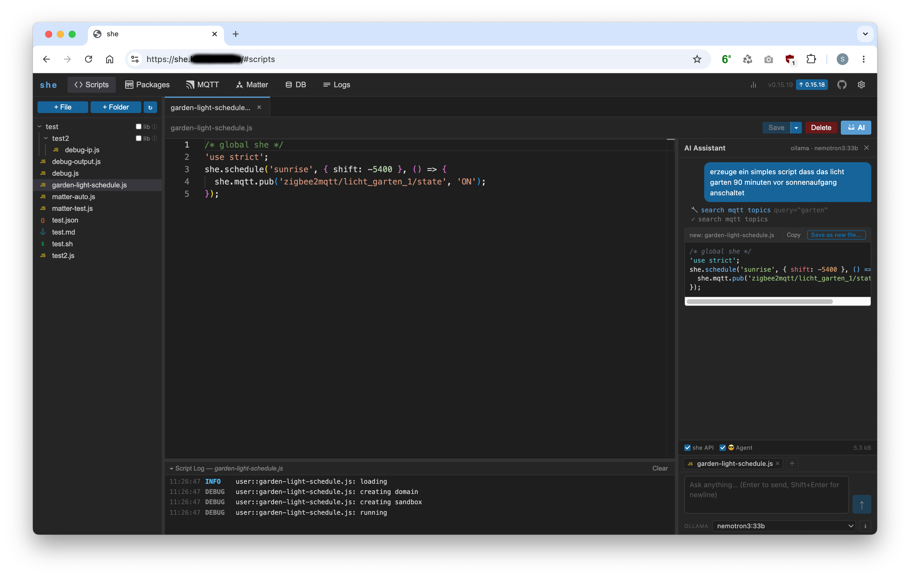
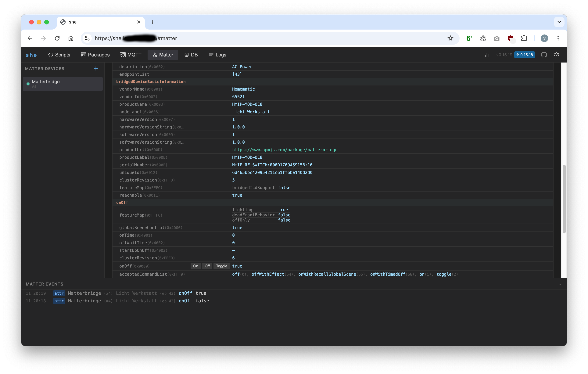
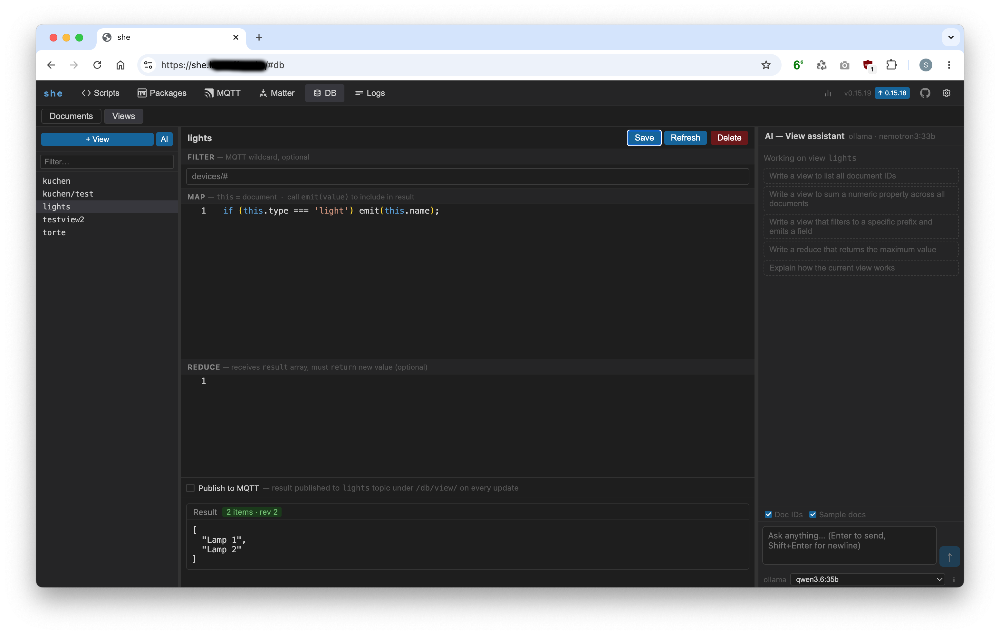
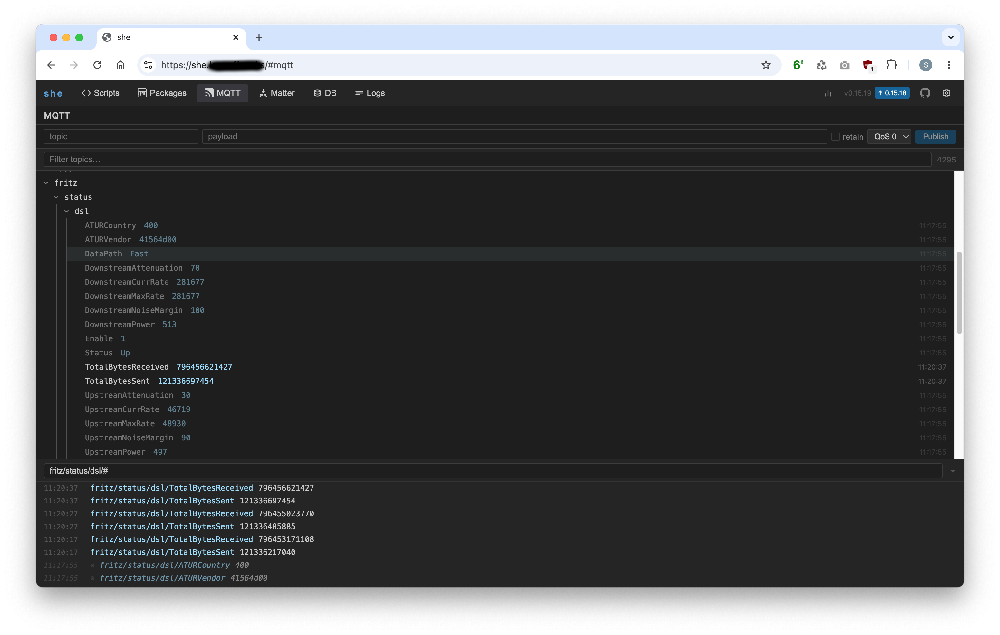
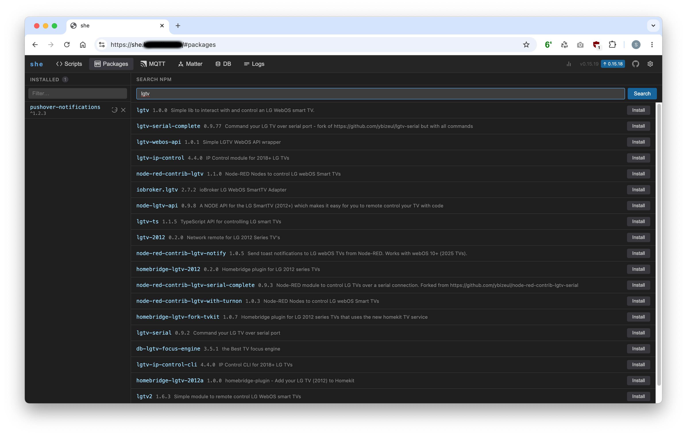

# Screenshots

### AI Assistant — Script Generation

---

### AI Assistant — Diff View

---

### Matter — Device Attribute Browser

---

### sheDB — View Editor

---

### MQTT — Topic Browser

---

### Packages — npm Package Manager

